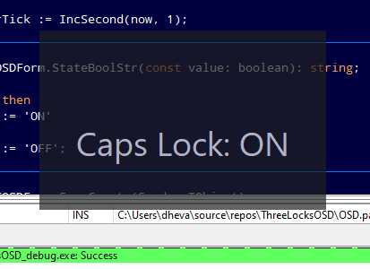

# ThreeLocksOSD

An app to show lock key statuses without 200+ MB of bloat

Basically a tiny Windows on-screen display telling you whether the Num Lock, Caps Lock, or Scroll Lock is on or not.  When one of these keys changes state, a small overlay briefly shows its current status

## Features

(TBA)

## Usage

1. Download the latest version from the releases page
2. Extract the ZIP
3. Run ThreeLocksOSD.exe
4. Press any lock keys: num lock, caps lock, or scroll lock

## Building

(TBA)

## Licence

MIT licence: [COPYING.TXT](./COPYING.TXT)
